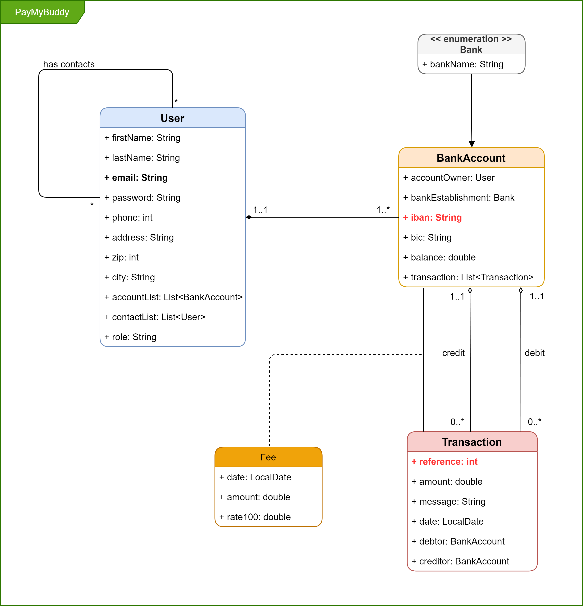
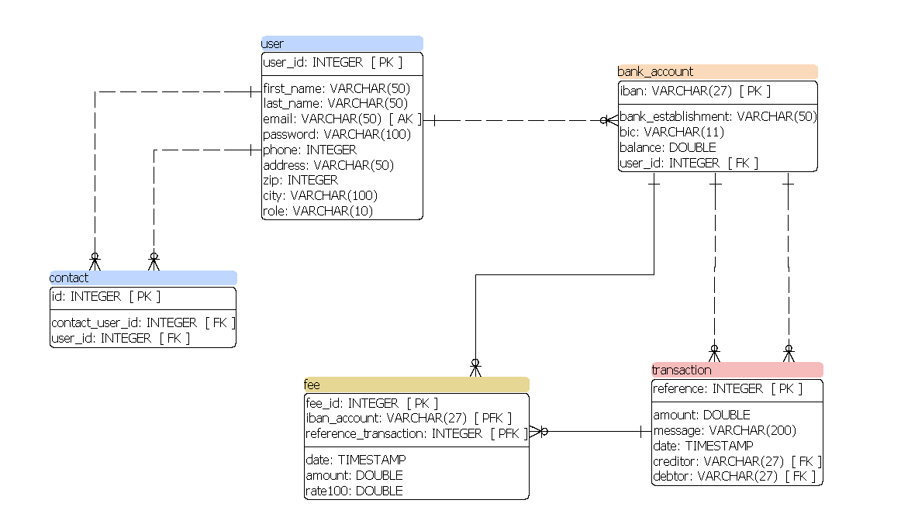

# Pay My Buddy

- Author: Geoffrey Aulombard - Java web-application developer student at OpenClassRooms

## Description

- A web application allowing you to manage and transfer money with other contact easier than through bank applications

## Getting Started

- This app runs on port 80, then address is "localhost" 
- The MySQL database works on port 3306

### Install DataBase

- first, run the script creat_db.sql located in src/main/resources/script
- second, run the script insert_data.sql located in src/main/resources/script
- more information in the application.properties file located in src/main/resources
- for tests: run the script creat_db_test.sql and insert_data.sql

## How it works
### Technologies

This is a Spring Boot Application, working with:

- Spring Web
- Spring Security
- Spring DATA JPA
- MySQL
- Thymeleaf

### Logic

- Users can have multiple accounts
- Account owned by only one user
- Users must be both register and in contact to be able to transfer money between their account

### UML diagram

### MPD diagram

